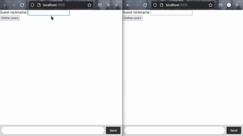

# Socket.io Chat

Socket.io Chat é uma aplicação de estudo para troca de mensagens em tempo real com outros usuários conectados. Utiliza a biblioteca javascript [Socket.io](https://socket.io/) e segue os requisitos da página [Get Started](https://socket.io/get-started/chat) que sugere implementar funcionalidades extras como "[Tema de Casa](https://socket.io/get-started/chat#homework)".

<br>



<br>

## Requisitos De Implementação Atendidos
### Básicos
* [x] Configuração da biblioteca Socket.io no projeto.
* [x] Fornecer interface HTML para o navegador.
* [x] Integração cliente e servidor via socket.
* [x] Emissão de eventos em tempo real via socket.
* [x] Transmissão de eventos para todos os clientes conectados.

### Homework
* [x] Trasnmite uma mensagem para todos os usuários conectados quando alguém conecta ou disconecta do chat. (**Implementado no desenvolvimento, mas ocultado por razões de usabilidade**)
* [x] Suporte para nicknames (apelidos de usuário).
* [x] O servidor não envia de volta um evento de mensagem para o usuário que a enviou. Apenas o lado da interface do clinete anexa a mensagem na tela ao pressionar 'enter'.
* [x] Mostra em tela quando algum usuário do chat está digitando.
* [x] Mostra em tela quem está online.
* [ ] Mensagens privadas. (**Em desenvolvimento**)

## Adições futuras
As adições futuras serão funcionalidades extras, planejadas além dos requisitos sugeridos.

* [ ] Suportar salas de chat.
    * [ ] Criação de salas públicas acessíveis por link.
    * [ ] Criação de salas privadas acessíveis por link e senha.
    * [ ] Listagem de salas públicas.

---

## Como Clonar E Testar Localmente

### Requisitos para testar

* Ter instalado [NodeJS](https://nodejs.org/pt-br/) em seu computador.
* Qualquer terminal ou prompt de comando.

No terminal ou prompt de comando execute os seguintes comandos (sem o cifrão '$').

```bash
# clona o repositório.
$ git clone https://github.com/otiagosantos/socket.io-chat.git

# Entra no diretório do projeto.
$ cd socket.io-chat

# Instala as dependências do projeto.
$ npm install

# Executa o servidor localmente.
$ npm run dev
```

Executado os comandos acima, basta acessar http://localhost:3000 no navegador de sua preferência.

_Para esse projeto, recomenda-se os navegadores Google Chrome ou Mozila Firefox._
